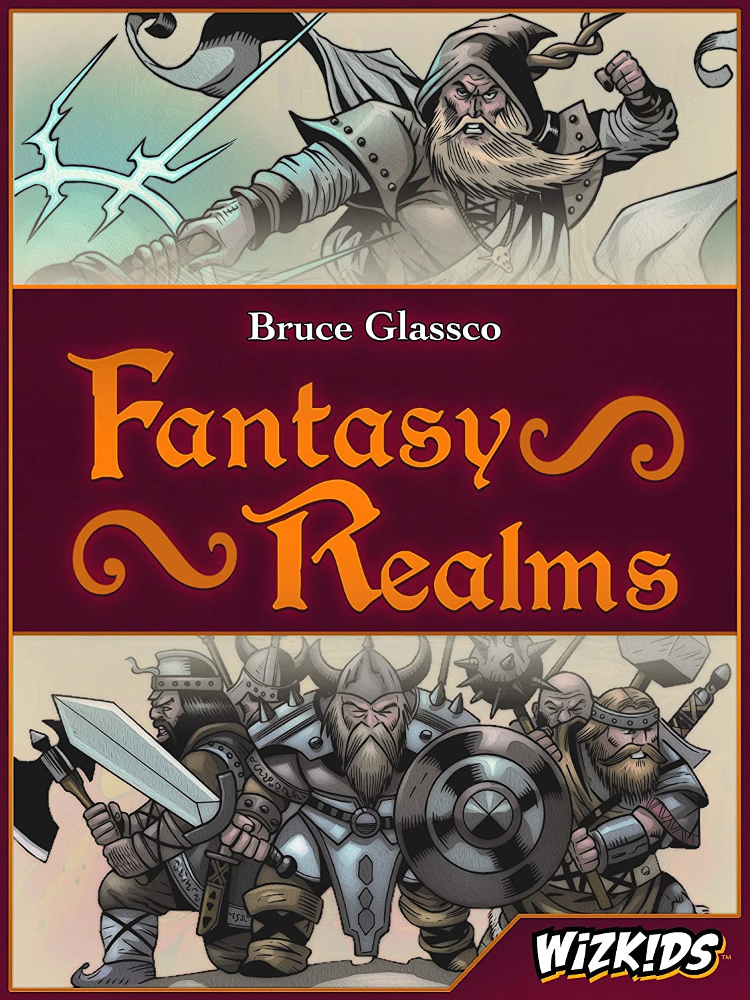

[](https://travis-ci.org/zinovik/fantasy-realms)



# Fantasy Realms

This bot...

---

## Working locally

### 1. create and fill .env file (use .env.example for help)

### 2. start the project

You can start project as lambda function:

```bash
npm run start:dev
```

### 3. you can involve the function locally

```bash
curl localhost:3000/api/message
```

---

https://api.telegram.org/bot<TELEGRAM_TOKEN>/setWebhook?url=https://<NGROK>.ngrok.io/api/message
https://api.telegram.org/bot<TELEGRAM_TOKEN>/setWebhook?url=https://fantasy-realms.vercel.app/api/message

---

Suit Name Value Text
Army Rangers 5 Bonus: +10 for each Land; Clears the word Army from Penalty section of all cards in hand
Army Elven Archers 10 Bonus: +5 if no Weather in hand
Army Dwarvish Infantry 15 Penalty: -2 for each other Army
Army Light Cavalry 17 Penalty: -2 for each Land
Army Celestial Knights 20 Penalty: -8 unless with at least one Leader
Artifact Protection Rune 1 Clears the Penalty sections on all cards in hand
Artifact World Tree 2 Bonus: +50 if every active card in hand is a different suit
Artifact Book of Changes 3 Bonus: you may change the suit of one other card. Its name, bonuses and penalties remain the same.
Artifact Shield of Keth 4 Bonus: +15 with any one Leader, +40 with both Leader and Sword of Keth
Artifact Gem of Order 5 Bonus: +10 for 3-card run, +30 for 4-card run, +60 for 5-card run, +100 for 6-card run, +150 for 7-card run
Beast Warhorse 6 Bonus: +14 with any Leader or Wizard
Beast Unicorn 9 Bonus: +30 with Princess, +15 with Empress, Queen, or Elemental Enchantress
Beast Hydra 12 Bonus: +28 with Swamp
Beast Dragon 30 Penalty: -40 unless with at least one Wizard
Beast Basilisk 35 Penalty: Blanks all Armies, Leaders, and other Beasts
Flame Candle 2 Bonus: +100 with Book of Changes, Bell Tower, and any one Wizard
Flame Fire Elemental 4 Bonus: +15 for each other Flame
Flame Forge 9 Bonus: +9 for each Weapon and Artifact
Flame Lightning 11 Bonus: +30 with Rainstorm
Flame Wildfire 40 Blanks all cards except Flames, Weather, Wizards, Weapons, Artifacts, Great Flood, Island, Mountain, Unicorn, & Dragon
Flood Fountain of Life 1 Bonus: Add the base strength of any Weapon, Flood, Flame, Land, or Weather in your hand
Flood Water Elemental 4 Bonus: +15 for each other Flood
Flood Island 14 Clears the Penalty on any one Flood or Flame
Flood Swamp 18 Penalty: -3 for each Army and Flame
Flood Great Flood 32 Penalty: Blanks all Armies, all Land except Mountain, all Flames except Lightning
Land Earth Elemental 4 Bonus: +15 for each other Land
Land Underground Caverns 6 Bonus: +25 with Dwarvish Infantry or Dragon; Clears the Penalty on all Weather
Land Forest 7 Bonus: +12 for each Beast and Elven Archers
Land Bell Tower 8 Bonus: +15 with any one Wizard
Land Mountain 9 Bonus: +50 with both Smoke and Wildfire; Clears the Penalty on all Floods
Leader Princess 2 Bonus: +8 for each Army, Wizard, and other Leader
Leader Warlord 4 Bonus: Equal to the base strengths of all Armies in your hand
Leader Queen 6 Bonus: +5 for each Army, +20 for each Army if in the same hand with King
Leader King 8 Bonus: +5 for each Army, +20 for each Army if in the same hand with Queen
Leader Empress 10 Bonus: +10 for each Army; Penalty: -5 for each other leader
Weapon Magic Wand 1 Bonus: +25 with any one Wizard
Weapon Elven Longbow 3 Bonus: +30 with Elven Archers or Warlord or Beastmaster
Weapon Sword of Keth 7 Bonus: +10 with any one Leader, +40 with both Leader and Shield of Keth
Weapon Warship 23 Penalty: Blanked unless with at least one Flood; Clears the word Army from Penalty section of all Floods
Weapon War Dirigible 35 Penalty: Blanked unless with at least one Army, Blanked if hand contains any weather
Weather Air Elemental 4 Bonus: +15 for each other Weather
Weather Rainstorm 8 Bonus: +10 for each Flood; Penalty: Blanks all Flames except Lightning
Weather Whirlwind 13 Bonus: +40 with Rainstorm and either Blizzard or Great Flood
Weather Smoke 27 Penalty: This card is blanked unless with at least one Flame
Weather Blizzard 30 Penalty: Blanks all Floods, -5 for each Army, Leader, Beast, and Flame
Wild Shapeshifter 0 May take on the name and suit of any Artifact, Leader, Wizard, Weapon or Beast. Does not take bonus or penalty.
Wild Mirage 0 May take on the name and suit of any Army, Land, Weather, Flood or Flame. Does not take bonus or penalty.
Wild Doppelganger 0 May duplicate the name, suit, base strength, and penalty but not bonus of any one other card in your hand
Wizard Necromancer 3 Bonus: At the end of the game, you may take one Army, Leader, Wizard, or Beast from the discard pile and add it to your hand as an eighth card.
Wizard Elemental Enchantress 5 Bonus: +5 for each Land, Weather, Flood, and Flame
Wizard Collector 7 Bonus: +10 if three different cards in same suit, +40 if four different cards, +100 if five different cards
Wizard Beastmaster 9 Bonus: +9 for each Beast; Clears the Penalty on all Beasts
Wizard Warlock Lord 25 Penalty: -10 for each Leader and other Wizard
